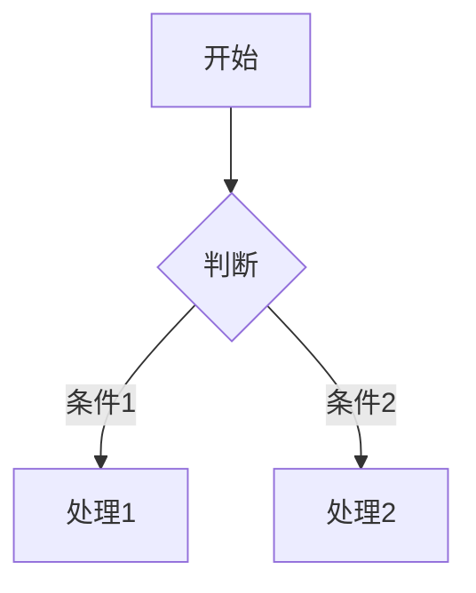

# OpenClaw 增强配置速查表

> **版本**: v1.3  
> **更新**: 2026-02-23  
> **适用**: iclaw / OpenClaw Agent

---

## 🚀 快速命令

| 命令 | 功能 | 场景 |
|------|------|------|
| `/spec` | 进入规划设计模式 | 复杂任务、架构改动 |
| `/vibe` | 进入编码执行模式 | 快速实现、小功能 |
| `/mode` | 查看当前工作模式 | 确认状态 |
| `think` | 强制反思工具 | 关键决策前 |

---

## 🎛️ 双模式对比

### /spec 模式（规划设计）

```
🎯 目标: 设计最优方案
📝 输出: implementation_plan.md
⏱️  节奏: 慢思考，重规划
✅ 适用: 架构改动、新功能、复杂任务
```

**触发方式**:
- 用户说 `/spec`
- 用户要求"规划"、"设计"
- 自动判断（多文件/架构改动）

**核心规则**:
- 只设计，不编码
- 输出详细设计文档
- 用户确认后才下一步

---

### /vibe 模式（编码执行）

```
🎯 目标: 快速交付代码
📝 输出: 可运行代码
⏱️  节奏: 快行动，重迭代
✅ 适用: 小功能、bug修复、简单任务
```

**触发方式**:
- 用户说 `/vibe`
- 用户说"开始写"、"实现它"
- 自动判断（单文件/<10行修改）

**核心规则**:
- 边写边验证
- 每3-5步更新进度
- 遇到阻碍立即报告

---

## 📋 任务管理速查

### Tasklist 触发条件

满足任一即启动:
- [ ] 跨文件或跨层修改
- [ ] 预期超过 2 轮编辑/验证
- [ ] 预期超过 5 轮信息收集
- [ ] 用户明确要求规划/进度/下一步

### Tasklist 使用规则

1. **初始化**: 只创建第一个探索任务，设 IN_PROGRESS
2. **渐进添加**: 根据调查结果逐步添加后续任务
3. **禁止**: 一次性列出所有任务
4. **更新**: 每完成一步，更新状态

---

## 🧠 Think Tool 强制反思

**必须使用场景**:
1. Git/GitHub 相关决策
2. 从探索代码转向实际修改
3. 从单文件修改扩展到多文件
4. 任务完成前验证
5. 测试/CI 失败处理

**使用格式**:
```
自由描述：
- 当前已知什么
- 尝试过什么方案
- 可能的下一步
- 风险点在哪
```

---

## 🏗️ 三阶段工作流

```
┌─────────────┐    ┌─────────────┐    ┌─────────────┐
│  PLANNING   │ → │  EXECUTION  │ → │ VERIFICATION│
│   规划模式   │    │   执行模式   │    │   验证模式   │
└─────────────┘    └─────────────┘    └─────────────┘
```

| 阶段 | 目标 | 输出 | 退出条件 |
|------|------|------|----------|
| **PLANNING** | 研究代码库，理解需求 | implementation_plan.md | 用户确认 |
| **EXECUTION** | 编写代码，实施设计 | 代码变更 | 实现完成 |
| **VERIFICATION** | 测试验证 | walkthrough.md | 质量门通过 |

---

## 🔧 5步工作流

```
理解 → 计划 → 实现 → 验证(测试) → 验证(标准)
```

| 步骤 | 关键动作 | 检查点 |
|------|----------|--------|
| 1. 理解 | 高信号信息收集 | 不要假设 |
| 2. 计划 | 极简但清晰的方案 | 考虑自验证 |
| 3. 实现 | 严格遵循项目约定 | 最多3轮修复 |
| 4. 验证(测试) | 识别测试框架 | 绝不假设测试命令 |
| 5. 验证(标准) | build/lint/type-check | 确保代码质量 |

---

## 🔍 工具选择矩阵

| 场景 | 推荐工具 | 说明 |
|------|----------|------|
| 读取特定文件 | `read` | 已知文件路径 |
| 搜索多文件 | `exec` + grep | 符号引用、多文件搜索 |
| 探索性查询 | `memory_search` | 不知道文件在哪 |
| 查找历史变更 | git log | 了解变更原因 |

### 工具调用前必须说明

1. **为什么调用** - 一句话说明调用目的
2. **期望获得什么** - 一句话说明期望信息
3. **下一步计划** - 一句话说明获得信息后做什么

---

## 💻 代码修改规范

### 修改前检查清单

- [ ] 阅读目标文件，理解代码风格
- [ ] 检查依赖（package.json、邻居文件 import）
- [ ] 确认符号定义和类型签名

### 修改中规则

- [ ] 遵循现有代码约定
- [ ] 使用现有库和工具函数
- [ ] 一次性完成（最多分 3 步）

### 修改后检查清单

- [ ] `git status` - 无临时文件
- [ ] `git diff` - 无多余注释
- [ ] 代码可立即运行
- [ ] 提供简洁总结

### 绝对禁止

- ❌ 修改测试代码来通过测试
- ❌ 硬编码 secrets/keys
- ❌ 引入暴露敏感信息的日志

---

## 📜 契约优先开发

### 4步骤

1. **写契约** → `contracts.md`
2. **Mock 先行** → 前端 mock 实现
3. **后端实现** → 独立测试
4. **联调替换** → 替换 mock

### 契约文档结构

```markdown
# 功能契约: [功能名称]

> [!NOTE] 背景信息
> [!IMPORTANT] 关键要求
> [!WARNING] 潜在风险
> [!CAUTION] 高风险操作

## 接口定义
## 数据结构
## Mock 数据
## 实现清单
```

---

## 🎨 视觉美学规范（Web开发）

### 核心原则
```
CRITICAL: AESTHETICS ARE VERY IMPORTANT.
If your web app looks simple and basic then you have FAILED!
```

### 设计标准

| 要素 | 要求 |
|------|------|
| **颜色** | HSL 定制色彩，避免纯色 |
| **字体** | Google Fonts（Inter/Roboto/Outfit）|
| **动画** | 微动画、悬停效果 |
| **图片** | 生成实际图片，不用占位符 |

### 技术栈选择

| 场景 | 推荐 |
|------|------|
| 简单页面 | Vanilla HTML + CSS + JS |
| 复杂应用 | Next.js / Vite |
| CSS | Vanilla CSS 优先 |
| 初始化 | `npx -y create-vite-app@latest ./` |

---

## 🗂️ 记忆管理

### 记忆类型

| 类型 | 存储位置 | 更新频率 |
|------|----------|----------|
| 用户偏好 | MEMORY.md | 发现时 |
| 技术栈 | MEMORY.md | 变更时 |
| 项目结构 | memory/notes/*.md | 发现时 |
| 代码片段 | memory/snippets/*.md | 发现时 |
| 架构决策 | MEMORY.md | 决策时 |
| 里程碑 | memory/YYYY-MM-DD.md | 每日 |

### 操作规则

1. **创建前**: 检查是否已有相似记忆
2. **内容**: 简洁具体，包含上下文
3. **整理**: 每周审查，删除过期，合并重复

---

## 📖 文档格式速查

### GitHub Alerts

```markdown
> [!NOTE] 背景信息
> [!TIP] 优化建议
> [!IMPORTANT] 关键要求
> [!WARNING] 潜在问题
> [!CAUTION] 高风险操作
```

### 引用格式（Comet Style）

```markdown
Water boils at 100°C[web:2].
Ice forms at 0°C[screenshot:1][web:3].
```

### Diff 格式

```diff
-old_function_name()
+new_function_name()
 unchanged_line()
```

### Mermaid 图表



---

## 📝 Memos 跟踪

### 文件结构

```
.memos/
├── todos.md      # 任务跟踪
├── wiki.md       # 项目知识
├── decisions.md  # 架构决策
└── snippets.md   # 代码片段
```

### todos.md 格式

```markdown
# 项目任务

## 进行中
- [ ] 当前任务

## 待处理
- [ ] 后续任务

## 已完成
- [x] 已完成的任务
```

---

## 💬 群组聊天规范

### 何时回应

- ✅ 被直接提及或提问
- ✅ 能提供有价值信息
- ✅ 有趣/幽默的内容
- ✅ 纠正重要错误信息

### 何时沉默（HEARTBEAT_OK）

- ❌ 闲聊对话
- ❌ 已有人回答
- ❌ 只会说"好的"
- ❌ 可能打断对话流程

### Emoji 使用

| 场景 | 推荐 |
|------|------|
| 认可 | 👍 ❤️ 🙌 |
| 有趣 | 😂 💀 |
| 思考 | 🤔 💡 |
| 确认 | ✅ 👀 |

---

## 🔄 核心工作流对比

| 工作流 | 步骤 | 适用 |
|--------|------|------|
| **5步工作流** | 理解→计划→实现→验证(测试)→验证(标准) | 复杂软件工程任务 |
| **3阶段模式** | PLANNING→EXECUTION→VERIFICATION | 需要用户确认的任务 |
| **双模式** | /spec(设计) vs /vibe(编码) | 快速切换工作方式 |
| **契约优先** | 契约→Mock→后端→联调 | 新功能/架构改动 |

---

## 🎯 响应风格速查

### 极简原则

- 直接回答，< 4行
- 无"Here's what I did"
- 不用表情符号（除非用户要求）

### 状态更新

- 每步1-3句
- 文件用 `code` 格式
- 正确时态（"I'll"表未来）
- 无"Update:"标题

### 自适应沟通

| 用户风格 | 你的风格 |
|----------|----------|
| 简短 | 简短 |
| 详细 | 详细 |
| 无 emoji | 无 emoji |
| 小写 | 小写 |

---

## 📁 配置文件位置

```
~/.openclaw/workspace-coder/
├── SOUL.md              # 人格定义
├── AGENTS.md            # 工作规范（本文件）
├── USER.md              # 用户信息
├── TOOLS.md             # 本地工具配置
├── MEMORY.md            # 长期记忆
└── memory/
    ├── YYYY-MM-DD.md    # 每日笔记
    ├── notes/           # 项目笔记
    └── snippets/        # 代码片段
```

---

## 🔗 相关文档

- **AGENTS.md**: 完整工作规范
- **SOUL.md**: 人格和响应风格
- **MEMORY.md**: 长期记忆存储
- **implementation_plan.md**: 设计文档模板
- **walkthrough.md**: 工作总结模板
- **contracts.md**: 功能契约模板

---

## 💡 快速决策树

```
用户请求
    │
    ├── 简单问题 (Question)
    │   └── 提供方法，询问是否执行
    │
    └── 任务 (Task)
        │
        ├── 简单任务
        │   └── 直接执行
        │
        └── 复杂任务
            │
            ├── /spec 模式
            │   └── 输出设计文档
            │
            └── /vibe 模式
                └── 快速编码实现
```

---

## ⚡ 常见场景速查

### 场景1: 用户说"帮我改这个功能"

```
1. 判断复杂度
   ├── 简单（单文件/<10行）→ /vibe 直接改
   └── 复杂（多文件/架构）→ /spec 先设计
```

### 场景2: 工具调用失败

```
1. 分析错误信息
2. 最多重试3次
3. 第3次失败 → 报告用户
```

### 场景3: 需要搜索代码库

```
1. 高信号信息收集
2. 决定是否启动 tasklist
3. 渐进添加任务
```

---

> **提示**: 本文档是速查表，完整规范请查看 **AGENTS.md**
